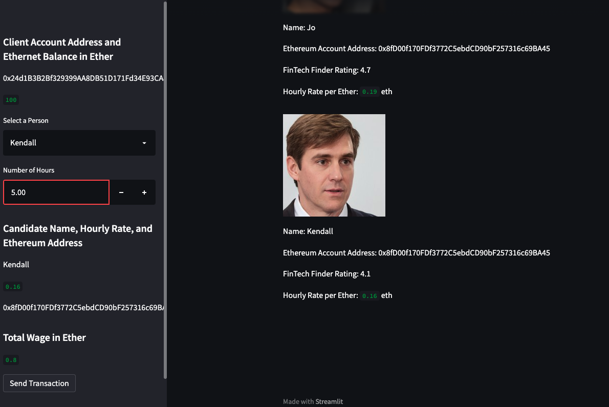
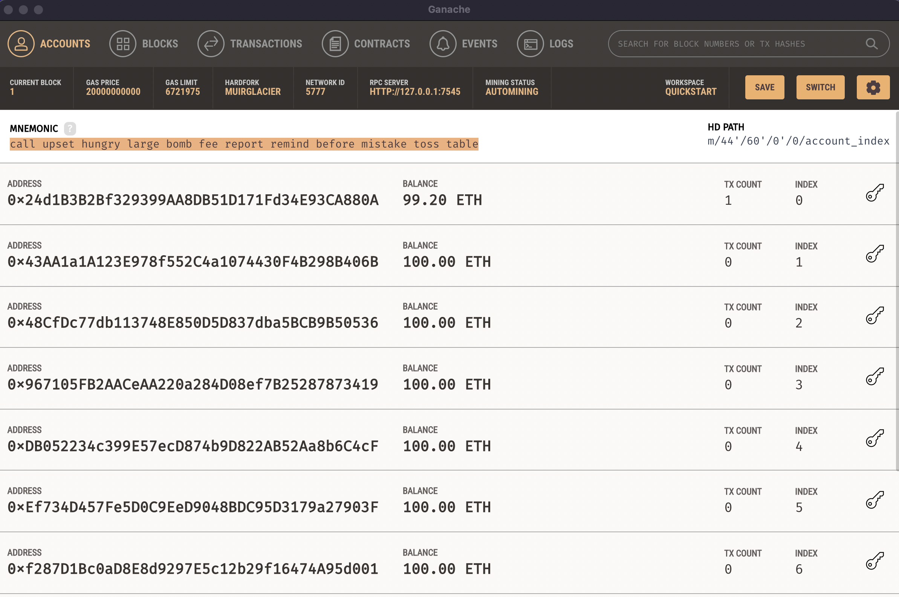

# Hiring-fintech

## To run the program: 

Source code: fintech_finder.py and crypto_wallet.py

run "streamlit run fintech_finder.py" in the terminal

The program will create a web interface and allow users to find fintech professionals from a list of candidates, hire them, and pay them with cryptocurrency.
 

## To test the program:

### 1. On the resulting webpage, select a candidate to hire

 

### 2. enter the number of hours (5 hours x 0.16 ETH = 0.8 ETH)

 

### 3. click the Send Transaction button to sign and send the transaction with the Ethereum account information. (If the transaction is successfully communicated to Ganache, validated, and added to a block, a resulting transaction hash code will be written to the Streamlit application sidebar.)

 

### 4. check the Ganache account. The balance of Ganache account was 100.00 ETH before sending transaction.

 

### 5. check the Ganache account. The balance of Ganache account became 99.20 ETH after sending transaction. (The transaction was successfully communicated to Ganache.)

